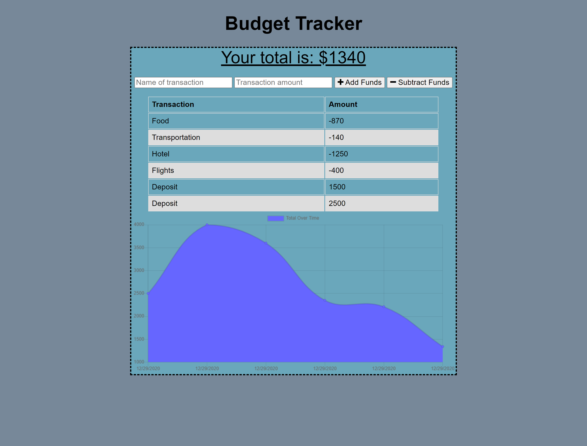

# ProgressiveBudget

## Description

The objective this week was to create a Progressive Budget Tracker. This app will give the user a fast and easy way to track their money and give them access to the information at any time. This app will allow the user to add expenses and deposits to their budget with or without an internet connection and make sure their balance is accurate. That is especially paramount if the user is traveling and does not have an internet connection, as this app will take the worry out of trying to find an internet connection and give you peace of mind while keeping track of your finances. 

## User Story

```
AS AN avid traveller I WANT to be able to track my withdrawals and deposits with or without a data/internet connection SO THAT my account balance is accurate when I am traveling
```

## Table of Contents

* [Usage](#usage)

* [Contributing](#Contributing)

* [Heroku Link](#heroku)

* [ScreenShots of Completed App](#screenshots)

* [Contact](#contact)

## Usage

The purpose of this app is to allow the user to have offline access to a Budget Tracker. The user will be able to add expenses and deposits to their budget with or without a connection. If transactions are added while the user is offline they will then populate and be shown when their connection is back online. 

## Contributing

If you are interested in contributing to this app please contact the owner of this repo via email. If given approval please follow these steps:

* Fork this repository.
* Create a branch: git checkout -b <branch_name>.
* Make your changes and commit them: git commit -m '<commit_message>'
* Push to the original branch: git push origin <project_name>/<location>
* Create the pull request.

Alternatively see the GitHub documentation on [creating a pull request](https://docs.github.com/en/free-pro-team@latest/github/collaborating-with-issues-and-pull-requests/creating-a-pull-request).

## Heroku

Please check out the following link to see the finished product:

[Deployed App](https://dm-budget-app.herokuapp.com/)

## ScreenShots


Vacation Budget Example:



## Contact
If you have any questions regarding this project and would like to reach out to me please feel free to do so at the following email: dimitarm01@gmail.com. Thank you.

Check Out My Github Page:
[Github](https://github.com/dspark8916)